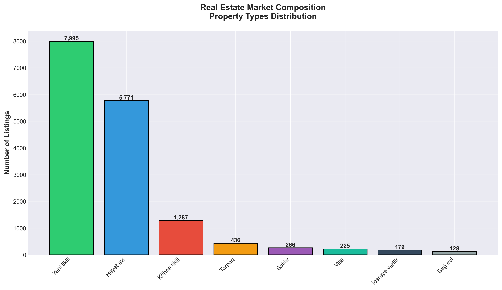
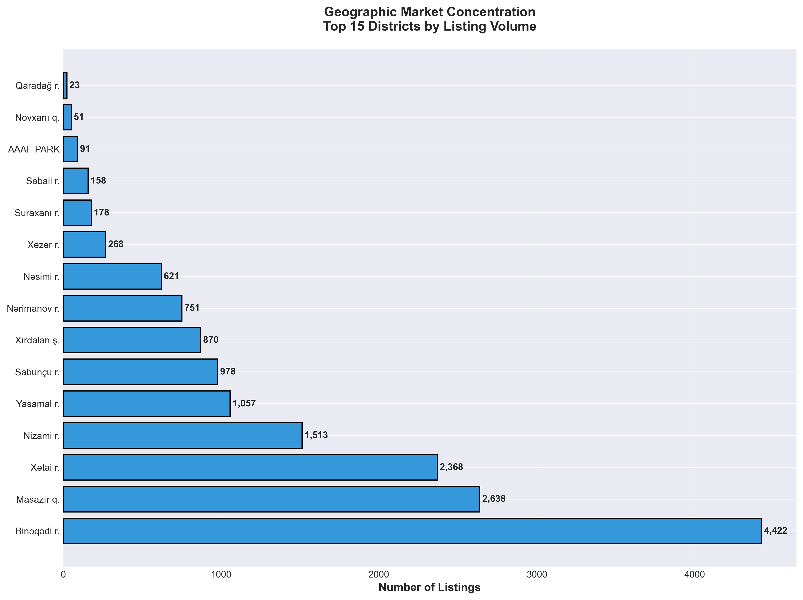
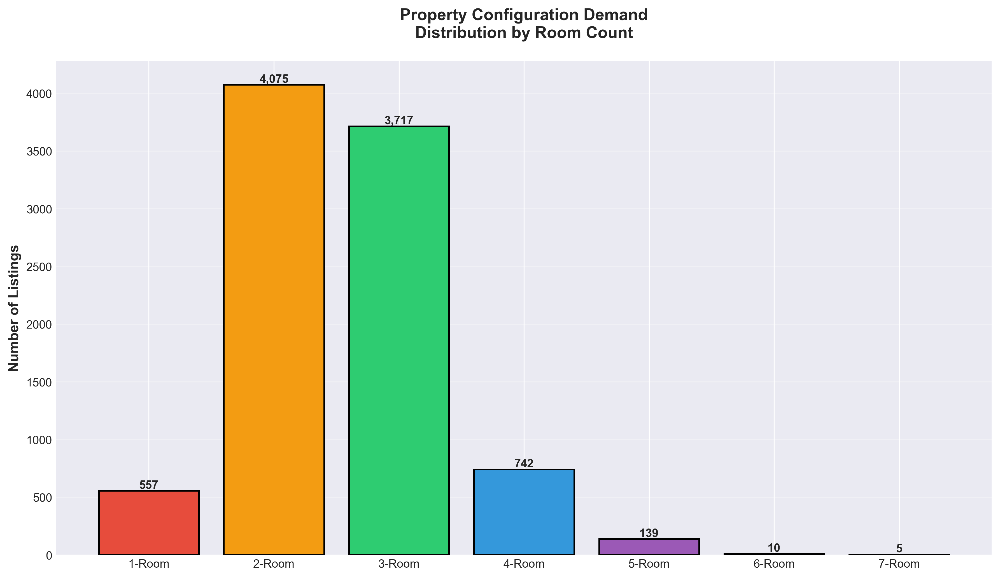
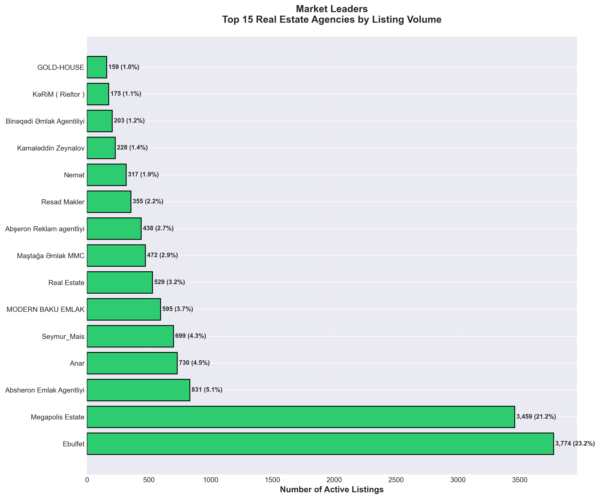
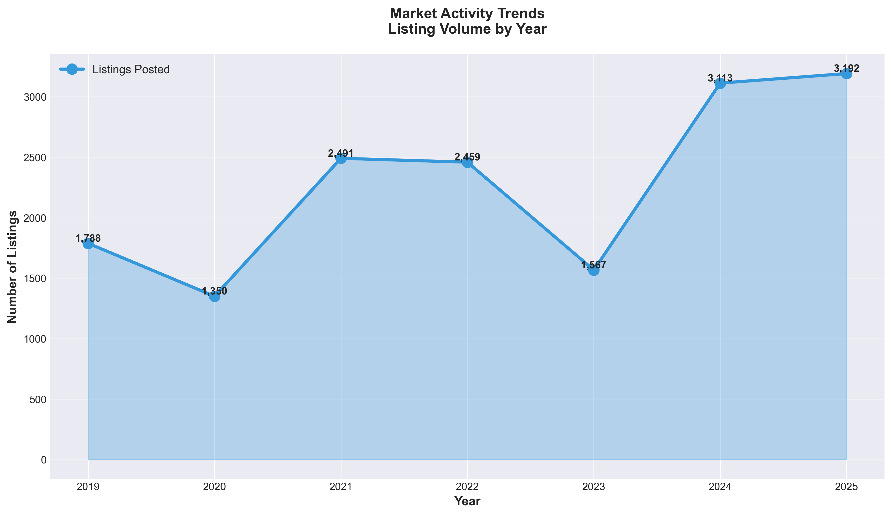
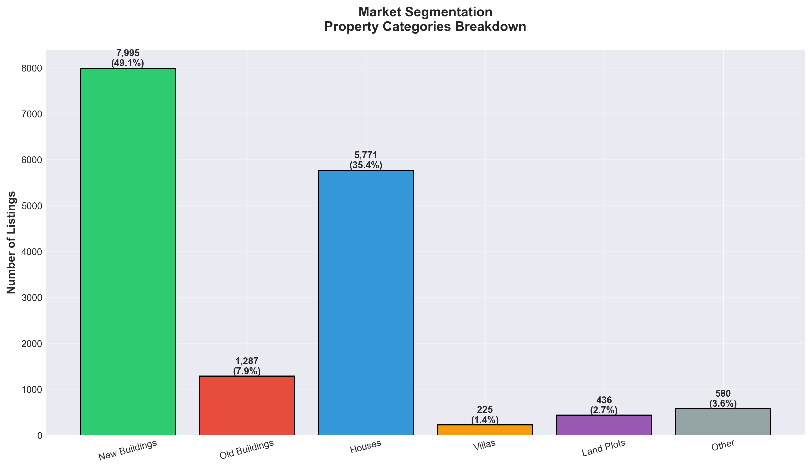
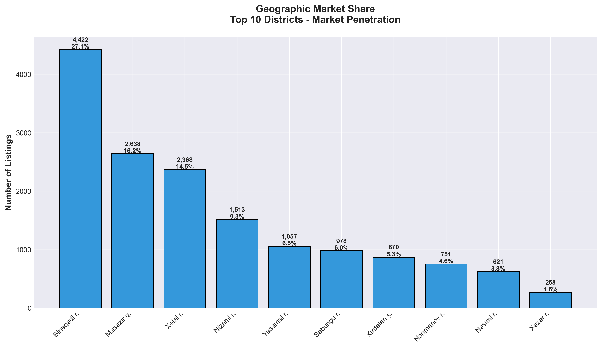
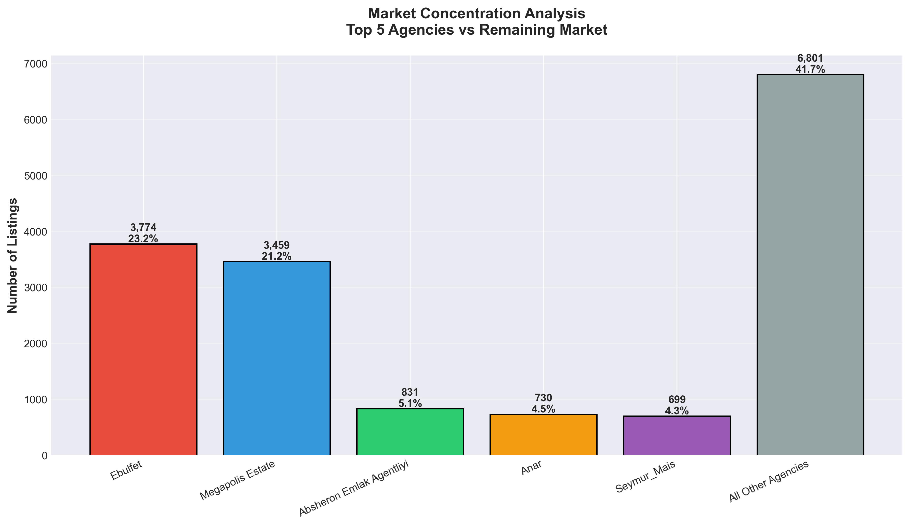

# Ucuztap.az Real Estate Market Intelligence Report

**Executive Summary - Azerbaijan Real Estate Marketplace Analysis**

*Based on comprehensive market data: 16,294 active property listings*

---

## 📊 Market Overview

This report provides strategic insights into the Azerbaijan real estate market through analysis of Ucuztap.az, one of the country's leading property listing platforms. The findings reveal critical trends, competitive dynamics, and opportunities that can inform business strategy, market entry decisions, and operational planning.

**Key Market Indicators:**
- **Total Active Listings:** 16,294 properties
- **Market Coverage:** 15+ major districts across Azerbaijan
- **Property Types:** 9 distinct categories
- **Active Agencies:** 100+ real estate agencies and individual sellers
- **Time Period:** 2019-2025 listings activity

---

## 🏗️ Market Composition: What's Being Sold

### Key Finding: New Construction Dominates the Market

**What This Shows:**
The market is heavily weighted toward new construction properties ("Yeni tikili" - 49.1%) and traditional houses ("Həyət evi" - 35.4%), which together account for **84.5% of all listings**.

**Why This Matters:**
1. **Strong Development Activity:** Nearly half the market consists of new builds, indicating robust construction sector activity and investor confidence
2. **Housing Preference:** The 35% share of traditional houses reveals persistent demand for standalone residential properties over apartments
3. **Limited Renovation Market:** Old buildings represent only 7.9%, suggesting either limited supply or stronger preference for new construction

**Business Implications:**
- Construction companies and developers are the primary market drivers
- Opportunities exist in the underserved renovation and old building segments
- Marketing strategies should emphasize new construction features and modern amenities

---

## 📍 Geographic Market Concentration

### Key Finding: Highly Concentrated Market with Clear Leaders

**What This Shows:**
Three districts dominate the market:
- **Binəqədi** - 27.1% (4,422 listings)
- **Masazır** - 16.2% (2,638 listings)
- **Xətai** - 14.5% (2,368 listings)

Combined, these top 3 districts control **57.8% of the entire market**.

**Why This Matters:**
1. **Strategic Locations:** These areas offer the best combination of demand, infrastructure, and development potential
2. **Market Entry Point:** New players should prioritize these districts for maximum market visibility
3. **Competition Intensity:** High listing volumes indicate fierce competition but also proven buyer demand

**Business Implications:**
- Real estate agencies must have strong presence in Binəqədi, Masazır, and Xətai to be competitive
- These districts likely offer better ROI for marketing spend due to higher buyer traffic
- Secondary markets (Nizami, Yasamal, Sabunçu) present expansion opportunities with less competition

---

## 🏠 Property Configuration Demand

### Key Finding: 2-3 Room Properties Drive Market Demand

**What This Shows:**
- **2-Room properties:** 25.0% of market (4,075 listings)
- **3-Room properties:** 22.8% of market (3,717 listings)
- Together: **47.8% of all listings**

**Why This Matters:**
1. **Family Size Targeting:** 2-3 room configurations align with typical family sizes in Azerbaijan
2. **Affordability Sweet Spot:** These sizes likely represent the most affordable segment, driving higher transaction volumes
3. **Inventory Planning:** Developers and sellers are responding to clear buyer preferences

**Business Implications:**
- Development projects should prioritize 2-3 room units for fastest turnover
- Larger 4+ room properties (5.6% market share) represent niche luxury segment
- Marketing campaigns should emphasize space optimization for mid-size properties

---

## 🏢 Competitive Landscape: Market Leaders

### Key Finding: Highly Fragmented Market with Two Dominant Players

**What This Shows:**
Top 2 agencies control **44.4% of market**:
- **Ebulfet** - 23.2% (3,774 listings)
- **Megapolis Estate** - 21.2% (3,459 listings)

The next tier (Absheron Emlak, Anar, Seymur) each hold 4-5% market share.

**Why This Matters:**
1. **Market Concentration Risk:** Two agencies have disproportionate market power
2. **Competition Opportunity:** The fragmented nature of remaining 55% creates opportunities for consolidation
3. **Brand Recognition:** Top agencies benefit from scale advantages in marketing and buyer reach

**Strategic Implications:**
- New entrants face significant barriers competing against established leaders
- Partnership or acquisition strategies could accelerate market share gain
- Differentiation (specialization, service quality, technology) is crucial for smaller players
- Individual sellers and small agencies should consider joining larger networks

---

## 📈 Market Activity Trends

### Key Finding: Strong Growth Momentum in Recent Years

**What This Shows:**
Listing activity has surged in 2024-2025:
- **2019:** 1,788 listings
- **2022:** 2,459 listings
- **2024:** 3,113 listings (+26% vs 2022)
- **2025:** 3,192 listings (projected annual pace)

**Why This Matters:**
1. **Market Recovery:** Strong rebound from 2023 slowdown (1,567 listings)
2. **Seller Confidence:** Increased listing activity suggests positive market sentiment
3. **Buyer Opportunity:** Higher inventory gives buyers more options and negotiation power

**Business Implications:**
- Marketing budgets should increase to match growing inventory and competition
- 2021-2022 showed peak activity (2,500+ listings) - this level is sustainable
- The 2023 dip may indicate market sensitivity to economic factors - monitor macro trends
- Current growth trajectory (2024-2025) presents optimal timing for market expansion

---

## 🏘️ Market Segmentation Analysis

### Key Finding: Clear Segmentation Between Urban and Traditional Housing

**What This Shows:**
Market divides into distinct segments:
- **New Urban Buildings:** 49.1% (7,995 listings)
- **Traditional Houses:** 35.4% (5,771 listings)
- **Old Urban Buildings:** 7.9% (1,287 listings)
- **Villas/Land/Other:** 7.6% combined

**Why This Matters:**
1. **Dual Market Structure:** Two parallel markets serve different buyer demographics
2. **Development Opportunities:** Villas and land plots (4.1% combined) are underserved premium segments
3. **Renovation Gap:** Old buildings represent untapped value-add opportunity

**Business Implications:**
- Separate marketing strategies needed for urban apartments vs traditional houses
- Premium segment (villas, land) offers high-margin opportunities despite smaller volume
- Old building renovation could create differentiated value proposition
- Mixed-use development projects could capture both urban and traditional preferences

---

## 📊 District Market Share Deep Dive

### Key Finding: Top 10 Districts Account for 95%+ of Market

**What This Shows:**
Geographic concentration is extreme:
- **Top 3 districts:** 57.8%
- **Top 5 districts:** 74.0%
- **Top 10 districts:** ~95%

**Why This Matters:**
1. **Resource Allocation:** Focus 80% of resources on top 10 districts for maximum ROI
2. **Market Saturation:** Top districts may be approaching saturation - monitor closely
3. **Expansion Timing:** Secondary markets should be considered once top 10 are optimized

**Business Implications:**
- Market entry should prioritize Binəqədi, Masazır, and Xətai districts
- Agencies operating in all top 10 districts have significant competitive advantage
- Districts outside top 10 represent <5% of market - avoid unless strategic reasons exist
- Consider district-specific pricing and marketing strategies

---

## 🎯 Competitive Concentration Analysis

### Key Finding: Oligopolistic Market Structure

**What This Shows:**
- **Top 5 agencies:** 56.4% of market (9,188 listings)
- **Remaining agencies:** 43.6% of market (7,106 listings)
- Market concentration ratio is high but not monopolistic

**Why This Matters:**
1. **Market Power:** Top 5 agencies can influence pricing and market practices
2. **Competitive Space:** 43.6% "other" segment shows room for competition
3. **Scale Economies:** Large agencies benefit from brand recognition and operational efficiency

**Strategic Implications:**
- Smaller agencies should focus on specialization (specific districts, property types, services)
- Technology and customer service can level the playing field against larger competitors
- Strategic partnerships between smaller agencies could create competitive scale
- Market leaders should invest in maintaining brand leadership and service quality

---

## 💼 Strategic Recommendations

### For Real Estate Agencies:

1. **Geographic Focus**
   - Prioritize Binəqədi, Masazır, and Xətai for maximum market coverage
   - Establish strong local presence before geographic expansion
   - Monitor emerging districts for early-mover advantage

2. **Portfolio Optimization**
   - Maintain 50/50 split between new buildings and traditional houses
   - Focus inventory on 2-3 room configurations (48% of demand)
   - Develop specialized expertise in underserved segments (villas, renovations)

3. **Competitive Positioning**
   - Differentiate through service quality, technology, or specialization
   - Consider partnerships to achieve scale if below top-5 market share
   - Build brand recognition through consistent market presence

### For Property Developers:

1. **Project Planning**
   - Design 60-70% of units as 2-3 room configurations
   - Target Binəqədi, Masazır, Xətai districts for prime projects
   - Consider mixed-use developments combining apartments and houses

2. **Market Timing**
   - Current growth momentum (2024-2025) supports new project launches
   - Monitor for market saturation signals in top districts
   - Plan phased development to match market absorption

3. **Product Positioning**
   - Emphasize new construction quality and modern features
   - Consider premium villa/land projects for high-margin opportunities
   - Explore renovation projects in old building segment

### For Market Entrants:

1. **Entry Strategy**
   - Partner with existing agencies for faster market access
   - Focus on underserved segments (old buildings, villas) to avoid direct competition
   - Leverage technology and service innovation to compete with established players

2. **Resource Allocation**
   - Concentrate 80% of resources in top 10 districts
   - Build expertise in 2-3 room properties before expanding to other segments
   - Invest in brand building and market presence

3. **Risk Management**
   - Monitor market concentration trends - dependency on few districts/agencies
   - Diversify across property types to reduce segment risk
   - Track yearly trends for early warning of market shifts

---

## 🎯 Key Takeaways for Decision Makers

1. **Market Structure:** Duopoly-like competition with two dominant agencies (44% share) and highly fragmented remaining market

2. **Geographic Concentration:** 58% of market concentrated in 3 districts - strategic presence in these areas is non-negotiable

3. **Product Demand:** 2-3 room properties in new buildings represent the market sweet spot (48% of demand)

4. **Growth Trajectory:** Strong upward momentum in 2024-2025 presents favorable timing for expansion

5. **Competitive Opportunity:** 43.6% market share held by agencies outside top-5 indicates room for competition and consolidation

6. **Segmentation:** Clear divide between new urban buildings (49%) and traditional houses (35%) requires dual marketing approach

7. **Underserved Segments:** Villas, land plots, and old building renovations represent differentiation opportunities

---

## 📌 Next Steps

**Immediate Actions:**
- Review current portfolio allocation vs market benchmarks
- Assess geographic presence in top 10 districts
- Evaluate competitive position against market leaders
- Identify quick wins in underserved segments

**Strategic Planning:**
- Develop district-specific market entry or expansion plans
- Create product mix optimization strategy aligned with 2-3 room demand
- Design partnership or acquisition strategy if below critical scale
- Build multi-year growth plan aligned with market trends

**Performance Monitoring:**
- Track monthly listing volumes for early trend detection
- Monitor top agency market share changes
- Measure district-level performance metrics
- Benchmark against industry leaders

---

*This report is based on comprehensive analysis of 16,294 active property listings as of January 2026. Data reflects market conditions at time of analysis and should be updated quarterly for ongoing strategic planning.*

---

## 📂 Supporting Materials

All visualizations and analysis charts are available in the `/charts` directory:
- Market composition and segmentation analysis
- Geographic distribution and penetration maps
- Competitive landscape and market share analysis
- Temporal trends and growth trajectories

For detailed data exploration, run: `python3 generate_charts.py`
